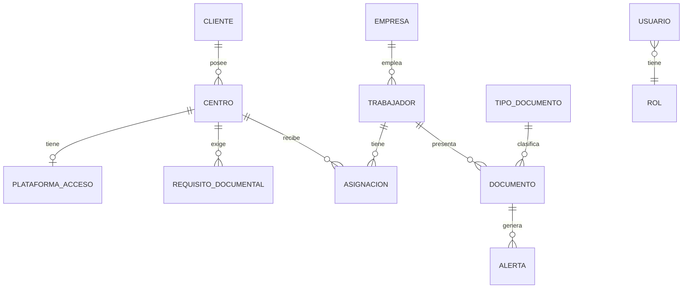

# Modelo de Datos — CAE Manager

Este modelo está derivado y validado contra `CAE_KHS_Cuadro_de_Control_2.xlsx`, el cuadro de control real que este sistema reemplaza. Cada entidad se justifica con lo que esa hoja de cálculo hace hoy manualmente, corrigiendo sus problemas de normalización conocidos (ver sección final).

> **Nota de vigencia (actualizada 2026-07-25)**: el dominio ha crecido desde la redacción original de este documento — el grafo completo y actualizado (Subcontrata, Vehículo, Visita, tablas de unión N:N, propietario polimórfico de Documento) está en **`DOMAIN.md`**, que es la fuente de verdad conceptual; este archivo conserva el detalle de columnas y el mapeo desde el Excel. Correcciones puntuales ya aplicadas abajo: `Trabajador.EmpresaId` es hoy **nullable** (Empresa *o* Subcontrata), y `Documento` tiene propietario polimórfico (no solo Trabajador). Además, la migración multi-tenant de `ADR-003-saas-multitenant.md` **ya está implementada y cerrada** (`PLAN-MIGRACION-MULTITENANT.md`, 5 etapas completadas, registrado en `ROADMAP.md`): las 25 tablas de dominio de este documento (todas salvo `Tenant` misma) tienen `TenantId` (Guid, **NOT NULL**), con filtro global de EF Core, un `SaveChangesInterceptor` que sella el tenant en alta y rechaza escritura cruzada, y los índices únicos que antes eran globales ya son compuestos `(TenantId, campo)` — reglas completas en `docs/MULTITENANCY.md`. Las columnas `TenantId` no se repiten campo a campo en cada tabla de abajo para no duplicar `docs/MULTITENANCY.md`; asúmelas presentes salvo que se indique lo contrario.

## Diagrama de entidades



## Entidades

### Cliente
Empresa titular de uno o más Centros de Trabajo. En el Excel es la columna "Cliente / Centro" de `Centros_Plataformas`, hoy fusionada con el centro en una sola fila de texto libre.

| Campo | Tipo | Notas |
|---|---|---|
| Id | Guid | PK |
| Nombre | string(200) | Ej. "COBEGA (Coca-Cola European Partners)" |
| EsCritico | bool | Del campo "Crítico" (C/N) del Excel |
| Notas | string?(2000) | Observaciones generales |
| EstaEliminado, ... | soft delete | |

### Centro
Ubicación física de un Cliente. **Normaliza** el problema del Excel donde un Cliente con varios centros (p. ej. "Mahou - San Miguel: todos los centros: Mahou 2013.0118, Alovera, Burgos, Lleida, Málaga, Penibética, Cervezas Reina 2000") aparece como una sola fila de texto. En CAE Manager, cada centro físico es su propia fila.

| Campo | Tipo | Notas |
|---|---|---|
| Id | Guid | PK |
| ClienteId | Guid | FK → Cliente |
| Nombre | string(200) | Ej. "Planta Sevilla", "Centro 0099" |
| CodigoCentro | string?(50) | Código interno del cliente si existe (ej. "Centro 0026") |
| Direccion | string?(300) | |
| Contacto | string?(500) | Nombre/teléfono/email de contacto en el cliente |
| ContratoVigenteHasta | date? | Del patrón "Caducidad de contrato: 31/12/2026" visto repetidamente en `Requisitos_Centro` |
| EstaEliminado, ... | soft delete | |

### PlataformaAcceso
Portal externo de terceros que un Centro exige usar para acreditar documentación (ej. CTAIMA CAE). Relación 1:1 opcional con Centro. **Dato sensible**: usuario/contraseña cifrados en reposo (ver `ARCHITECTURE.md`).

| Campo | Tipo | Notas |
|---|---|---|
| Id | Guid | PK |
| CentroId | Guid | FK → Centro, único |
| NombrePlataforma | string(150) | Ej. "CTAIMA CAE" |
| UrlAcceso | string?(500) | |
| UsuarioCifrado | bytes | Cifrado con Data Protection API |
| ContrasenaCifrada | bytes | Cifrado con Data Protection API |
| Notas | string?(1000) | |

### Empresa
La empresa contratista cuyo personal se coordina — la organización que opera CAE Manager. El Excel real ya tiene dos: "KHS S.A." (personal local) y "KHS GmbH" (personal extranjero), como dos hojas con idéntica estructura. Esto confirma que **Empresa es un discriminador de Trabajador**, no dos módulos distintos.

| Campo | Tipo | Notas |
|---|---|---|
| Id | Guid | PK |
| RazonSocial | string(200) | |
| EstaEliminado, ... | soft delete | |

### Trabajador
Empleado de una Empresa. Corresponde a una fila de la hoja `Empleados` (o `Extranjeros`).

| Campo | Tipo | Notas |
|---|---|---|
| Id | Guid | PK |
| EmpresaId | Guid? | FK → Empresa — **nullable**: un Trabajador pertenece a una Empresa **o** a una Subcontrata (`SubcontrataId?`), mutuamente excluyentes (ver `DOMAIN.md`) |
| SubcontrataId | Guid? | FK → Subcontrata (ver arriba) |
| Nombre | string(100) | |
| Apellidos | string(150) | |
| Dni | string(20) | Único por tenant: `(TenantId, Dni)` — `docs/MULTITENANCY.md` § 5 |
| FechaNacimiento | date? | |
| Email | string?(200) | |
| Observaciones | string?(1000) | Del campo "Observaciones / notas especiales" — casos particulares como altas específicas de obra |
| EstaEliminado, ... | soft delete | Una "baja" de trabajador es soft delete, no borrado |

### TipoDocumento
Catálogo maestro, corresponde 1:1 a la hoja `Parametros`. Es configuración del sistema (módulo 6, "Tipos de Documento"), editable solo por Administrador.

| Campo | Tipo | Notas |
|---|---|---|
| Id | Guid | PK |
| Nombre | string(150) | Ej. "Apto médico laboral", "Reciclaje 4h" |
| VigenciaMeses | int? | Null = no caduca (ej. Formación 60h/20h/6h, Art.18) |
| AplicaVencimientoAutomatico | bool | Si false, el documento no genera alerta de vencimiento aunque tenga fecha |
| Notas | string?(500) | |
| Orden | int | Orden de presentación en tablas/formularios |

Datos semilla reales (de `Parametros`, 15 tipos): Apto médico laboral (12m), EPIS — firma (12m), Reciclaje 4h (48m), Formación Art. 19 (36m), Formación 60h/20h/6h base convenio (sin caducidad, 3 tipos independientes), Información Art. 18 (sin caducidad), Carretillas elevadoras, PEMP, LOTO 4h, Seguridad alimentaria, Primeros auxilios, Espacios confinados, Trabajos en altura 8h (estos últimos 7 sin caducidad por defecto, configurable).

### Documento
Instancia de un TipoDocumento para un Trabajador. Corresponde a las columnas "Fecha / Vencimiento / Estado" repetidas por bloque en `Empleados`.

| Campo | Tipo | Notas |
|---|---|---|
| Id | Guid | PK |
| TrabajadorId | Guid? | Propietario **polimórfico excluyente**: exactamente uno de TrabajadorId / ClienteId / EmpresaId / VehiculoId está poblado (ver `DOMAIN.md`) |
| ClienteId / EmpresaId / VehiculoId | Guid? | Ver arriba |
| TipoDocumentoId | Guid | FK → TipoDocumento |
| FechaEmision | date | |
| FechaVencimiento | date? | **Calculada**: `FechaEmision + TipoDocumento.VigenciaMeses` si `AplicaVencimientoAutomatico`, si no null. Se persiste (columna calculada o al guardar) para poder indexar/filtrar por vencimiento sin recalcular en cada query. |
| ArchivoUrl | string?(500) | Referencia al PDF adjunto vía `IFileStorageService` |
| Comentarios | string?(1000) | |
| EstaEliminado, ... | soft delete | |

**Estado** (`VIGENTE`, `PROXIMO`, `URGENTE`, `VENCIDO`, `NO_APLICA`) **no se almacena**: se calcula en el dominio a partir de `FechaVencimiento` y los umbrales de `ParametroSistema` (ver más abajo), igual que las fórmulas del Excel. Guardarlo como columna física lo desincronizaría de los umbrales configurables.

### Asignacion
Relación N:N entre Trabajador y Centro, con historial de alta/baja. Corresponde a la matriz "X" de la hoja `Asignaciones`, que hoy no guarda fechas — es una mejora directa sobre el Excel.

| Campo | Tipo | Notas |
|---|---|---|
| Id | Guid | PK |
| TrabajadorId | Guid | FK → Trabajador |
| CentroId | Guid | FK → Centro |
| FechaAlta | date | |
| FechaBaja | date? | Null = asignación activa |

Índice único en (`TrabajadorId`, `CentroId`, `FechaAlta`) para evitar altas duplicadas simultáneas.

### RequisitoDocumental
Exigencia adicional de un Centro más allá de la documentación base común. Corresponde a la hoja `Requisitos_Centro`. En el Excel es texto libre; se mantiene como texto libre en v1 (el propio Excel indica que muchos de estos requisitos son heterogéneos y ad-hoc — forzar una relación 1:1 con TipoDocumento sería prematuro, YAGNI), pero se estructuran los campos que sí son datos reales.

| Campo | Tipo | Notas |
|---|---|---|
| Id | Guid | PK |
| CentroId | Guid | FK → Centro |
| Descripcion | string(1000) | Ej. "AEAT nominativo A15002637; EPIS anuales; descargar QR" |
| PeriodicidadEspecial | string?(300) | Ej. "AEAT nominativo: renovar cada 6 meses aunque el certificado tenga validez de 12" — sobrescribe la vigencia por defecto del TipoDocumento para ese centro |
| BloqueaAcceso | bool | Si true, el sistema debe mostrar advertencia de bloqueo si el requisito no está cumplido (visto literalmente en el Excel: "⛔ Sin ER y permiso de inicio de trabajo vigentes, el sistema BLOQUEA el acceso") |
| Notas | string?(1000) | |

### Alerta
Notificación generada cuando un Documento entra en umbral de aviso o vence. Se genera (job programado o al calcular estado) y se marca como leída por usuario.

| Campo | Tipo | Notas |
|---|---|---|
| Id | Guid | PK |
| DocumentoId | Guid | FK → Documento |
| Nivel | enum | `Proximo` \| `Urgente` \| `Vencido` |
| FechaGeneracion | datetime | |
| LeidaPor | Guid?[] / tabla puente | Lectura por usuario |

### ParametroSistema
Configuración global editable por Administrador. Corresponde a la sección "Umbrales de alerta" de `Parametros`.

| Campo | Valor semilla | Notas |
|---|---|---|
| UmbralAmbarDias | 30 | "Alerta ÁMBAR (próximo a vencer)" |
| UmbralRojoDias | 15 | "Alerta ROJA / URGENTE" |

### Usuario / Rol / Auditoria
Provistos por ASP.NET Core Identity (`AspNetUsers`, `AspNetRoles`, ...) más una tabla `Auditoria` (EntidadTipo, EntidadId, Accion, DatosAntes, DatosDespues, UsuarioId, FechaUtc) poblada por el interceptor descrito en `ARCHITECTURE.md`.

## Regla de negocio central: cálculo de estado de un Documento

```
si TipoDocumento.AplicaVencimientoAutomatico == false → NO_APLICA
si Documento.FechaVencimiento == null                  → NO_APLICA
diasRestantes = FechaVencimiento - hoy
si diasRestantes < 0                                    → VENCIDO
si diasRestantes <= ParametroSistema.UmbralRojoDias      → URGENTE
si diasRestantes <= ParametroSistema.UmbralAmbarDias     → PROXIMO
si no                                                    → VIGENTE
```

Si el Centro tiene un `RequisitoDocumental` con `PeriodicidadEspecial` para ese tipo de documento, esa periodicidad prevalece sobre la vigencia por defecto del `TipoDocumento` al calcular `FechaVencimiento` para asignaciones en ese centro.

Esta función vive en `Domain` como lógica pura (sin dependencias), cubierta por pruebas unitarias exhaustivas — es el corazón del producto (KPIs del Dashboard, semáforos de tabla, alertas).

## Problemas de normalización del Excel que este modelo corrige

1. **Cliente y Centro fusionados en texto libre** → entidades separadas con relación 1:N real.
2. **Credenciales de plataformas en texto plano, compartidas en la misma hoja que el resto de datos** → tabla separada, cifrada, con acceso restringido y auditado.
3. **Sin historial**: cambios se pisan sin dejar rastro → tabla `Auditoria` + soft delete en toda entidad relevante.
4. **Estado ("VIGENTE"/"VENCIDO") escrito como fórmula frágil por celda** → calculado centralizadamente en Domain a partir de parámetros configurables.
5. **Requisitos y notas especiales dispersos en comentarios de texto** (ej. "Máximo 11 licencias de trabajador disponibles", "Plataforma pagada solo para 2 trabajadores") → quedan como `Notas`/`Descripcion` en v1 (siguen siendo texto porque son genuinamente heterogéneos), pero ahora estructurados por Centro y consultables, no perdidos en una celda.

## Convenciones

- PK: `Guid` (`Id`) en todas las entidades — evita colisiones al importar datos de fuentes externas (el importador de Excel) y facilita claves no secuenciales.
- Fechas: `DateOnly` para fechas sin hora (emisión, vencimiento, alta/baja), `DateTime` (UTC) para timestamps de auditoría.
- Nombres de tabla y columna en español, `PascalCase`, sin abreviaturas (`FechaVencimiento`, no `FechaVenc`).
- Toda entidad con ciclo de vida de negocio (no catálogos puros) implementa soft delete.
