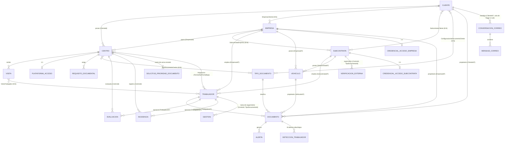

# Modelo de Dominio — Hydra (CAE Manager)

**Fuente de verdad conceptual** del dominio: agregados, relaciones e invariantes, verificados contra el código de `src/CaeManager.Domain/` (2026-07-23; sección Comunicaciones/Gestiones actualizada 2026-08-05 tras Fases 84/87/88/90/91). `DATABASE.md` documenta la persistencia (tablas, columnas, índices); este documento explica el *modelo* — si divergen, gana el código y se corrige el documento. Para la dimensión multi-tenant ver `docs/MULTITENANCY.md`.

## Grafo de relaciones (verificado en código)

## Conceptos y reglas estructurales

- **Cliente**: empresa propietaria de los Centros donde se realizan los trabajos (Retail Iberia S.A., Bebidas del Norte S.A., ...). No opera el sistema. Tiene `EjecutivoUsuarioId` (Gestor CAE dueño de la cartera — base del alcance por rol).
- **Empresa**: la contratista cuyos trabajadores realizan los trabajos (Ibertec S.A., EcoPlant Reciclaje S.L., ...). **No pertenece a un Cliente** — trabaja para muchos (`EmpresaCliente`, N:N), y un Cliente contrata a muchas. Esta relación N:N es intocable: es el corazón del modelo CAE.
- **Subcontrata**: empresa subcontratada que aporta personal/flota. N:N tanto con Cliente como con Empresa. Desde ADR-005 lleva `NivelServicio` (`Gestionada` — se gestiona su documentación, semántica anterior y valor por defecto — / `Supervisada` — solo se audita su cumplimiento externo); el cambio de nivel es operación de negocio (`CambiarNivelServicio`), nunca cambio de entidad. **VerificacionExternaSubcontrata** registra cada comprobación manual en la plataforma del titular de un Centro (fecha, resultado `Valido`/`NoValido`/`NoEncontrado`, `ValidoHasta?`, evidencia opcional en storage, verificador); el checklist de qué verificar es `TipoDocumentoCentro` (no hay segundo catálogo) y el estado de supervisión **se calcula, nunca se almacena** (`CalculadoraEstadoSupervision`, mismos umbrales de `ParametroSistema`).
- **Centro**: ubicación física. Pertenece a un único Cliente (`ClienteId`) y es operado por una Empresa (`EmpresaId`) — dos padres simultáneos, no es hijo único de nadie. Satélites: `CanalGestionDocumental` (N por Centro — cada acceso con su etiqueta de propósito en texto libre y sus credenciales cifradas, uno marcado principal; era 1:1 y se llamaba `PlataformaAcceso`), `TipoDocumentoCentro` (tipos exigidos — pestaña "Requisitos del Centro"; sustituyó a `RequisitoDocumental`, retirado).
- **Trabajador / Vehículo**: pertenecen a una Empresa **o** una Subcontrata (`EmpresaId?`/`SubcontrataId?` mutuamente excluyentes — `EsDeSubcontrata`). **Sin `ClienteId`**: su relación con Clientes es derivada (Trabajador vía `Asignacion`+Centro; Vehículo transitiva) y puede ser múltiple simultáneamente — un `ClienteId` singular sería estructuralmente falso (decisión debatida y cerrada; ver `docs/MULTITENANCY.md` § 3).
- **Asignacion**: N:N Trabajador↔Centro con historial (`FechaAlta`/`FechaBaja?`; activa = sin baja). Índice único `(TrabajadorId, CentroId, FechaAlta)`.
- **Visita**: periodo (`FechaInicio`–`FechaFin`) de trabajadores en un Centro, con N:N `VisitaTrabajador`. `NivelUrgenciaVisita` (`EnCurso`/`Critica`/`Urgente`/`Normal`) se **calcula, nunca se almacena** — mismo patrón que el estado de Documento — comparando horas hasta `FechaInicio` contra `ParametroSistema.HorasCriticasVisita`/`HorasAvisoVisita` (24h/48h por defecto), porque las plataformas documentales de los Clientes suelen exigir un plazo mínimo de validación antes de dejar entrar a los trabajadores (Fase 90). `SolicitudPrioridadDocumento` (Comunicaciones, con tenant) registra solo el rastro de que se pidió prioridad de validación al contacto de un Centro — no bloquea reenviar, evita únicamente el "¿ya se pidió hoy?" (Fase 91).
- **ConversacionCorreo / MensajeCorreo** (`Comunicaciones`): agregado raíz de la bandeja compartida, **multicanal sobre el mismo agregado** vía `CanalConversacion` (`Correo`/`WhatsApp`, Fase 84) — los nombres se mantienen como deuda nominal tras incorporar WhatsApp (renombrarlos es un refactor aparte). `ClienteId?` null cae en cola de triage hasta que un Gestor la asigna. Único agregado del repositorio donde las entidades hijas (`Mensajes`/`Participantes`) se exponen como colecciones de solo lectura sobre campos privados en vez de gestionarse por repositorio aparte, porque el propio diseño exige que el alta de mensaje/participante sea una operación de negocio única del agregado. Ventana de servicio de WhatsApp (24h desde `FechaUltimoMensajeEntranteUtc`, `DuracionVentanaServicio`) limita a plantillas aprobadas fuera de ese plazo. `ContactoWhatsApp` (con tenant) es un catálogo autoalimentado teléfono→Cliente que aprende del primer triage resuelto para enrutar conversaciones nuevas del mismo teléfono directamente al Gestor de cartera. `MacroRespuesta` son plantillas de respuesta reutilizables (`ClienteId?` null = genérica del tenant). `SugerenciaGestionCorreo`/`SugerenciaVisitaCorreo` (con tenant) son candidatos detectados por IA sobre un `MensajeCorreo` entrante — mismo patrón sugerencia-nunca-automática que `DeteccionTrabajador`: nunca crean una `Gestion`/`Visita` directamente, solo el Gestor confirma desde la Bandeja. Ver `ARQUITECTURA-INTEGRACIONES.md` § 12.7 para el diseño completo del canal WhatsApp.
- **Gestion** (`Gestiones`): tarea de seguimiento documental de un Trabajador en un Centro concreto (p. ej. "renovar EPI de Juan Pérez en el Centro X") — **no crea ni referencia ningún Documento**, es solo el registro de que hace falta gestionar algo y de que ya se atendió (`EstadoGestion.Pendiente`/`Completada`). Si el mismo Trabajador está de alta en varios Centros a la vez se crea una Gestion por Centro, porque la renovación real ocurre centro a centro. `MensajeCorreoOrigenId?` enlaza con el `SugerenciaGestionCorreo` que la originó, si aplica.
- **Documento**: instancia de un `TipoDocumento` con **propietario polimórfico excluyente** — exactamente uno de `TrabajadorId`/`ClienteId`/`EmpresaId`/`VehiculoId`. `FechaVencimiento` derivada de la vigencia del tipo; **estado nunca almacenado** (ver abajo).
- **TipoDocumento**: catálogo documental (configurable por tenant, ver `docs/MULTITENANCY.md` § 7) con vigencia en meses, obligatoriedad, y flags de IA (`LecturaIaActiva`, `DeteccionTrabajadoresActiva`).
- **Alerta / NotificacionUsuario / DeteccionTrabajador / RegistroAuditoria**: derivados operativos (avisos de vencimiento, notificaciones persistentes por usuario, altas/bajas detectadas por IA en documentos, auditoría de cambios).
- **ParametroSistema**: umbrales de alerta (ámbar/rojo). Hoy singleton; pasa a una fila por tenant.
- **Evaluación**: evaluación de riesgo laboral de un Centro (`CentroId` obligatorio), opcionalmente referida a un Trabajador concreto (`TrabajadorId?`). `Puntuacion` (0-100) + `Observaciones?` (máx. 2000 car.).
- **Incidencia**: incidencia operativa de un Centro (accidente o incumplimiento — `TipoIncidencia`), con `GravedadIncidencia` (Leve/Grave/MuyGrave), opcionalmente referida a un Trabajador (`TrabajadorId?`). Ciclo de vida propio: `Resuelta`/`ResueltaEnUtc?` (`MarcarResuelta()`/`Reabrir()`), independiente del soft delete de `EntidadBase`.

## Agregados raíz

Con repositorio propio (nunca `IRepository<T>` genérico): `Cliente`, `Empresa`, `Subcontrata`, `VerificacionExternaSubcontrata`, `Centro`, `Trabajador`, `Vehiculo`, `Documento`, `TipoDocumento`, `Asignacion`, `Visita`, `Alerta`, `NotificacionUsuario`, `ParametroSistema`, `RegistroAuditoria`, `Evaluacion`, `Incidencia`, `ConversacionCorreo`, `ContactoWhatsApp`, `MacroRespuesta`, `SolicitudPrioridadDocumento`, `SugerenciaGestionCorreo`, `SugerenciaVisitaCorreo`, `Gestion` — y `Tenant` (ver ADR-003). `DelegacionTenant`/`AsignacionOperadorDelegado` (ADR-004, Capa 0) son catálogo global sin `TenantId`, mismo tratamiento que `Tenant` — no son agregados de dominio CAE. Las tablas de unión y satélites 1:1 se gestionan a través de su raíz.

## Regla de negocio central

El estado de un Documento (`Vigente`/`Proximo`/`Urgente`/`Vencido`/`NoAplica`) **se calcula, nunca se almacena** — `CalculadoraEstadoDocumento` (Domain, lógica pura) a partir de `FechaVencimiento` y los umbrales de `ParametroSistema`. Es el corazón del producto (semáforos, KPIs, alertas).

## Invariantes protegidas por los agregados

- Propietario de Documento: exactamente uno de los cuatro posibles.
- Trabajador/Vehículo: Empresa o Subcontrata, nunca ambos ni ninguno.
- Asignación: sin altas duplicadas simultáneas al mismo Centro.
- Soft delete en toda entidad con ciclo de vida (`EntidadBase`); eliminar nunca borra la fila.
- Credenciales de acceso (PlataformaAcceso, CredencialAcceso*): cifradas en reposo, nunca en logs ni auditoría en claro.

## Notas de deuda del modelo

- `CredencialAccesoEmpresa`/`CredencialAccesoSubcontrata` compartían la misma forma letra por letra — ahora derivan de `CredencialAccesoPortal` (`CaeManager.Domain.Common`, P2 #27 de `docs/business/MATURITY_REVIEW.md`). `CanalGestionDocumental` (Centro) queda deliberadamente fuera de esa base: sirve dos propósitos (Plataforma o Email) y no tiene la misma forma — forzarla ahí sería peor que la duplicación que resuelve.
- No existe infraestructura de Domain Events (decisión: no construirla sin caso de uso real — YAGNI).
- `Dni`/`Cif`/`Email` (`CaeManager.Domain.Common`, P2 #27 de `docs/business/MATURITY_REVIEW.md`) son value objects nuevos con la misma validación que ya aplicaban a mano los constructores de `Trabajador`/`Cliente`/`Empresa` (Dni/Cif) o que no existía en absoluto (Email, hasta ahora solo comprobado como no-vacío). Ninguna entidad existente se migró a usarlos todavía — `Trabajador.Dni`/`Cliente.Cif`/`Empresa.Cif` siguen siendo `string`, con ~150 sitios de uso combinados que un cambio de tipo sin poder compilar en este entorno habría arriesgado más de lo que valía. Disponibles para código nuevo; migrar lo existente es trabajo de seguimiento.
