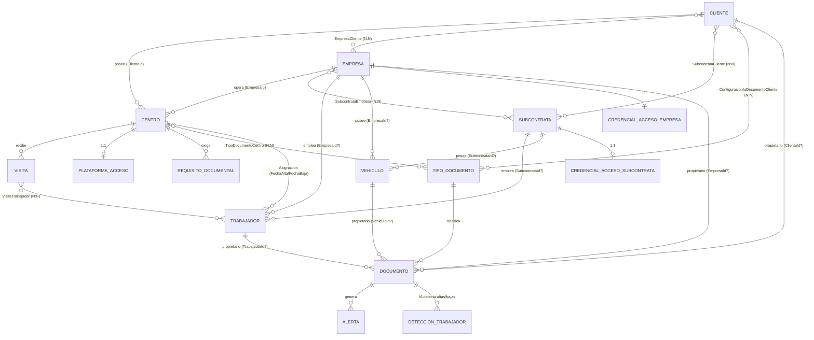

# Modelo de Dominio — Hydra (CAE Manager)

**Fuente de verdad conceptual** del dominio: agregados, relaciones e invariantes, verificados contra el código de `src/CaeManager.Domain/` (2026-07-23). `DATABASE.md` documenta la persistencia (tablas, columnas, índices); este documento explica el *modelo* — si divergen, gana el código y se corrige el documento. Para la dimensión multi-tenant ver `docs/MULTITENANCY.md`.

## Grafo de relaciones (verificado en código)

## Conceptos y reglas estructurales

- **Cliente**: empresa propietaria de los Centros donde se realizan los trabajos (Retail Iberia S.A., Bebidas del Norte S.A., ...). No opera el sistema. Tiene `EjecutivoUsuarioId` (Gestor CAE dueño de la cartera — base del alcance por rol).
- **Empresa**: la contratista cuyos trabajadores realizan los trabajos (Ibertec S.A., EcoPlant Reciclaje S.L., ...). **No pertenece a un Cliente** — trabaja para muchos (`EmpresaCliente`, N:N), y un Cliente contrata a muchas. Esta relación N:N es intocable: es el corazón del modelo CAE.
- **Subcontrata**: empresa subcontratada que aporta personal/flota. N:N tanto con Cliente como con Empresa.
- **Centro**: ubicación física. Pertenece a un único Cliente (`ClienteId`) y es operado por una Empresa (`EmpresaId`) — dos padres simultáneos, no es hijo único de nadie. Satélites: `PlataformaAcceso` (1:1, credenciales cifradas), `RequisitoDocumental` (exigencias adicionales; hoy sin UI), `TipoDocumentoCentro` (tipos exigidos).
- **Trabajador / Vehículo**: pertenecen a una Empresa **o** una Subcontrata (`EmpresaId?`/`SubcontrataId?` mutuamente excluyentes — `EsDeSubcontrata`). **Sin `ClienteId`**: su relación con Clientes es derivada (Trabajador vía `Asignacion`+Centro; Vehículo transitiva) y puede ser múltiple simultáneamente — un `ClienteId` singular sería estructuralmente falso (decisión debatida y cerrada; ver `docs/MULTITENANCY.md` § 3).
- **Asignacion**: N:N Trabajador↔Centro con historial (`FechaAlta`/`FechaBaja?`; activa = sin baja). Índice único `(TrabajadorId, CentroId, FechaAlta)`.
- **Visita**: periodo (`FechaInicio`–`FechaFin`) de trabajadores en un Centro, con N:N `VisitaTrabajador`.
- **Documento**: instancia de un `TipoDocumento` con **propietario polimórfico excluyente** — exactamente uno de `TrabajadorId`/`ClienteId`/`EmpresaId`/`VehiculoId`. `FechaVencimiento` derivada de la vigencia del tipo; **estado nunca almacenado** (ver abajo).
- **TipoDocumento**: catálogo documental (configurable por tenant, ver `docs/MULTITENANCY.md` § 7) con vigencia en meses, obligatoriedad, y flags de IA (`LecturaIaActiva`, `DeteccionTrabajadoresActiva`).
- **Alerta / NotificacionUsuario / DeteccionTrabajador / RegistroAuditoria**: derivados operativos (avisos de vencimiento, notificaciones persistentes por usuario, altas/bajas detectadas por IA en documentos, auditoría de cambios).
- **ParametroSistema**: umbrales de alerta (ámbar/rojo). Hoy singleton; pasa a una fila por tenant.

## Agregados raíz

Con repositorio propio (nunca `IRepository<T>` genérico): `Cliente`, `Empresa`, `Subcontrata`, `Centro`, `Trabajador`, `Vehiculo`, `Documento`, `TipoDocumento`, `Asignacion`, `Visita`, `Alerta`, `NotificacionUsuario`, `ParametroSistema`, `RegistroAuditoria` — y `Tenant` (nuevo, ver ADR-003). Las tablas de unión y satélites 1:1 se gestionan a través de su raíz.

## Regla de negocio central

El estado de un Documento (`Vigente`/`Proximo`/`Urgente`/`Vencido`/`NoAplica`) **se calcula, nunca se almacena** — `CalculadoraEstadoDocumento` (Domain, lógica pura) a partir de `FechaVencimiento` y los umbrales de `ParametroSistema`. Es el corazón del producto (semáforos, KPIs, alertas).

## Invariantes protegidas por los agregados

- Propietario de Documento: exactamente uno de los cuatro posibles.
- Trabajador/Vehículo: Empresa o Subcontrata, nunca ambos ni ninguno.
- Asignación: sin altas duplicadas simultáneas al mismo Centro.
- Soft delete en toda entidad con ciclo de vida (`EntidadBase`); eliminar nunca borra la fila.
- Credenciales de acceso (PlataformaAcceso, CredencialAcceso*): cifradas en reposo, nunca en logs ni auditoría en claro.

## Notas de deuda del modelo

- Tres clases duplican el concepto "credenciales de portal externo" (`PlataformaAcceso`, `CredencialAccesoEmpresa`, `CredencialAccesoSubcontrata`) — unificarlas es un cambio de modelo independiente, no mezclar con otros refactors.
- `RequisitoDocumental` existe en Domain sin Commands/Queries ni UI.
- No existe infraestructura de Domain Events (decisión: no construirla sin caso de uso real — YAGNI).
