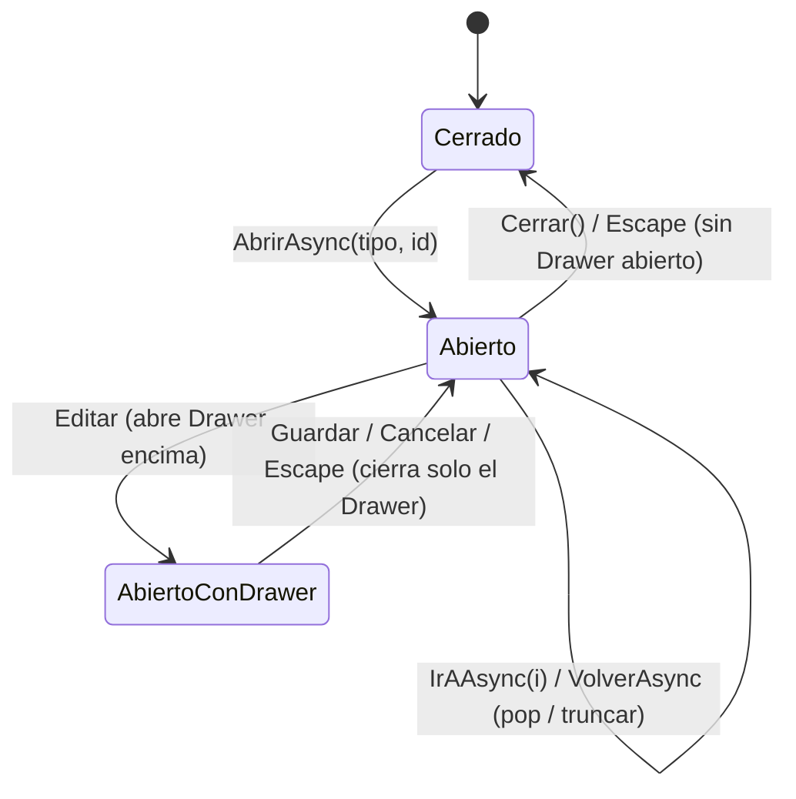

# Arquitectura — Context Workspace

**Estado**: Diseño de arquitectura. No implementado. Este documento define el sistema de navegación contextual pedido — un panel lateral único e "inteligente" que sustituye el concepto genérico de "Side Workspace" descrito en `PLAN-MASTER-DETAIL-WORKSPACE.md` § 4 por una especificación concreta y con reglas más estrictas. **Este documento sustituye la tabla de pestañas de `PLAN-MASTER-DETAIL-WORKSPACE.md` § 4** por la especificada más abajo (§ 6), que es la autoritativa a partir de ahora.

**Decisiones cerradas con el usuario (2026-07-25)**: cierre automático del panel al navegar a otra pantalla por el menú principal (§ 8.1); Subcontrata sí tiene Context Workspace propio, panel mínimo igual que Empresa (§ 6); Centro/Trabajador → Vehículos se resuelve como vista transitiva vía Empresa/Subcontrata, sin relación de modelo nueva (§ 15); Documento → Versiones se resuelve reutilizando `Auditoria` (misma fuente que Historial) añadiendo `FechaSubida`/`FechaCambio`, sin entidad `VersionDocumento` nueva (§ 15). Sigue abierto: Documento → Validación (§ 15.6).

---

## 1. Reglas de diseño (invariantes, no sugerencias)

| # | Regla pedida | Cómo se convierte en invariante arquitectónico |
|---|---|---|
| R1 | Nunca abrir Side Workspaces anidados | Solo existe **una instancia** de `ContextWorkspacePanel` en todo el árbol de componentes (vive en el layout raíz, no por página). No hay ningún mecanismo en el diseño para instanciar una segunda. Cualquier navegación "hacia dentro" muta el estado de la instancia existente. |
| R2 | El Workspace cambia de contenido internamente | El panel es un **shell fijo** (cabecera + breadcrumb + tabs + cuerpo). Navegar a una entidad relacionada no cambia el shell, solo el contenido que despacha `ContextWorkspaceContent` según el estado actual. |
| R3 | Cada entidad posee pestañas | Registro estático `RegistroPestañasContexto` (§ 6), una entrada por tipo de entidad, fija en tiempo de compilación — no configurable por el usuario, no generada dinámicamente. |
| R4 | Breadcrumb | Estructura de **pila** (`IReadOnlyList<ContextWorkspaceEntry>`), no de árbol — refleja el camino realmente recorrido, no la jerarquía de datos (que ya vimos en el plan anterior que no es un árbol único: Documento con 4 propietarios, Centro con 2 padres). |
| R5 | Volver atrás | Dos formas equivalentes: click en un segmento del breadcrumb (salta y trunca la pila) y un control "Volver" explícito (saca un nivel). Ver § 8. |
| R6 | Teclado | Ver tabla completa § 12. |
| R7 | Responsive | Ver tabla por breakpoint § 13. |
| R8 | Reutilizar componentes existentes | Ver tabla de reutilización § 14 — ningún componente de `DesignSystem/` se reimplementa. |

---

## 2. Modelo conceptual: dos ejes independientes

El diseño separa explícitamente dos conceptos que es fácil confundir:

- **Eje de pestañas** (horizontal, dentro de una misma entidad): "estoy viendo al Cliente X, pestaña Documentación". No genera entrada de breadcrumb nueva — cambiar de pestaña es lateral, no es "navegar".
- **Eje de navegación contextual** (breadcrumb, entre entidades): "vine del Cliente X, entré a la Empresa Y, entré al Centro Z". Cada salto genera una entrada nueva en la pila.

Cambiar de pestaña **nunca** empuja el breadcrumb. Navegar a una entidad relacionada **siempre** empuja el breadcrumb y resetea la pestaña activa a `Información` (punto de entrada consistente a cualquier entidad nueva, salvo que el enlace de origen pida una pestaña concreta explícitamente — p. ej. un enlace "Ver documentación de este Trabajador" desde otro lado sí puede abrir directo en la pestaña `Documentación`).

---

## 3. Arquitectura de componentes

```
WorkspaceLayout (MainLayout, ya existe/Fase 0 del plan anterior)
│
├── @Body (lista maestra de la página actual — Clientes, Trabajadores, ...)
│
└── ContextWorkspacePanel.razor          ← instancia ÚNICA, vive aquí, no en cada página
    ├── ContextWorkspaceCabecera.razor    (título de la entidad actual + botón cerrar)
    ├── ContextWorkspaceBreadcrumb.razor  (pila de navegación + botón "Volver")
    ├── Tabs.razor                        (componente nuevo del Plan anterior § Fase 0, reutilizado tal cual)
    └── ContextWorkspaceContent.razor     (despachador — renderiza la pestaña activa de la entidad activa)
        └── <DynamicComponent Type="@TipoComponentePestaña" Parameters="@Parametros" />
            └── p.ej. ClienteInformacionTab.razor / EmpresaCentrosTab.razor / etc. (§ 6)
```

Ningún componente de página (`Clientes.razor`, `Trabajadores.razor`, ...) instancia su propio panel de detalle. Todos comparten el mismo `ContextWorkspacePanel` a través de un servicio inyectado — así es como R1 queda garantizado por construcción, no por convención.

---

## 4. Servicio de estado: `ContextWorkspaceService`

Servicio **scoped** (uno por circuito de Blazor Server — un usuario, una pestaña de navegador, un estado de workspace). Es la única fuente de verdad; ningún componente guarda la pila localmente.

Contrato (diseño de interfaz, no implementación):

```csharp
public interface IContextWorkspaceService
{
    IReadOnlyList<ContextWorkspaceEntry> Pila { get; }
    ContextWorkspaceEntry? Actual { get; }          // tope de la pila, null = cerrado
    bool EstaAbierto { get; }

    event Action? OnCambio;

    // Abre desde cero (desde una lista maestra) — nueva pila de 1 elemento.
    Task AbrirAsync(TipoEntidadContexto tipo, Guid id, string? pestañaInicial = null);

    // Navega "hacia dentro" a una entidad relacionada — empuja la pila.
    Task NavegarARelacionadoAsync(TipoEntidadContexto tipo, Guid id, string? pestañaInicial = null);

    // Cambia de pestaña dentro de la entidad actual — NO toca la pila.
    void CambiarPestaña(string pestaña);

    // Breadcrumb: salta a un punto anterior de la pila, truncando lo posterior.
    Task IrAAsync(int indice);

    // Un nivel atrás (equivalente a IrAAsync(Pila.Count - 2)).
    Task VolverAsync();

    // Cierra completamente, limpia la pila.
    void Cerrar();
}
```

`ContextWorkspaceEntry` (record, inmutable):

```csharp
public sealed record ContextWorkspaceEntry(
    TipoEntidadContexto Tipo,
    Guid Id,
    string EtiquetaBreadcrumb,   // nombre a mostrar, resuelto una vez al navegar (evita refetch al pintar el breadcrumb completo)
    string PestañaActiva);
```

`TipoEntidadContexto` — enum cerrado con exactamente las 7 entidades con Context Workspace (Cliente, Empresa, Centro, Trabajador, Vehiculo, Documento, Subcontrata — 8→7 de `PLAN-MASTER-DETAIL-WORKSPACE.md` § 4 menos Visita, que **no** tiene pestañas propias en esta especificación; Subcontrata se incorporó como panel mínimo el 2026-07-25, ver § 6/§ 15).

**Por qué `EtiquetaBreadcrumb` se guarda en la entrada y no se recalcula**: pintar el breadcrumb completo (hasta 4-5 niveles típico: Cliente→Empresa→Centro→Trabajador→Documento) no debe disparar una query por segmento en cada render; se resuelve una vez al hacer el salto (la pantalla que origina la navegación ya tiene el nombre en memoria — viene de la fila de la tabla que el usuario clicó) y se congela en la entrada.

---

## 5. Despachador de contenido

`ContextWorkspaceContent.razor` no usa una cadena de `@if/else if` por entidad (no escala a 6 entidades × 4-6 pestañas = ~30 combinaciones). Usa un registro estático resuelto en `Program.cs`/`ApplicationServiceCollectionExtensions`:

```csharp
public static class RegistroPestañasContexto
{
    public static IReadOnlyDictionary<TipoEntidadContexto, IReadOnlyList<DefinicionPestaña>> Pestañas { get; }
}

public sealed record DefinicionPestaña(string Clave, string Etiqueta, Type TipoComponente, string Icono);
```

`ContextWorkspaceContent` resuelve `Pestañas[Actual.Tipo]` para pintar el `Tabs.razor`, y renderiza `Pestañas[Actual.Tipo].First(p => p.Clave == Actual.PestañaActiva).TipoComponente` vía `<DynamicComponent>` de Blazor (built-in, sin reflexión custom), pasando `EntidadId = Actual.Id` como parámetro. Es explícito y tabular — se lee como una tabla, no como lógica dispersa (mismo criterio de "Consistencia de patrones" de `PROJECT.md`).

Cada componente de pestaña (`ClienteInformacionTab.razor`, `CentroTrabajadoresTab.razor`, ...) es responsable de:
1. Cargar sus propios datos (Query específica, con `IAlcanceDatosService` aplicado — ver riesgo ya señalado en el plan anterior § 7.1).
2. Si es una pestaña de relación (lista), pintar la sub-lista con `tabla-datos`/`QuickGrid` y, al hacer click en una fila relacionada, llamar `ContextWorkspaceService.NavegarARelacionadoAsync(...)` — **nunca** abrir un `Drawer`/`Modal` propio para "ver el detalle", eso violaría R1.
3. Si es una pestaña de datos propios editables, mostrar los datos de solo lectura + un botón "Editar" que abre el `Drawer` existente (ver § 10) — la edición no es responsabilidad del Workspace, sigue siendo responsabilidad del patrón Crear/Editar ya establecido.

---

## 6. Registro de pestañas por entidad (autoritativo)

| Entidad | Pestañas (orden fijo) | Fuente de datos / notas de mapeo |
|---|---|---|
| **Cliente** | Información · Empresas · Subcontratas · Documentación · Actividad · Notas | Información = `Cliente` propio. Empresas = `EmpresaCliente` (N:N). Subcontratas = `SubcontrataCliente` (N:N). Documentación = `Documento` con `ClienteId = actual`. Actividad = `Auditoria` filtrada por `EntidadTipo=Cliente, EntidadId=actual` (reutiliza la Query de `/auditoria`, no una nueva). Notas = campo `Cliente.Notas` (string único hoy — ver gap § 15). |
| **Empresa** | Información · Centros · Documentación · Historial | Información = `Empresa` propio + `CredencialAccesoEmpresa`. Centros = `Centro` con `EmpresaId = actual`. Documentación = `Documento` con `EmpresaId = actual`. Historial = `Auditoria` filtrada por Empresa. |
| **Centro** | Información · Formularios · Trabajadores · Vehículos · Plataforma · Historial | Información = `Centro` propio. Formularios = `RequisitoDocumental` de este Centro + `TipoDocumentoCentro` (tipos exigidos) — **requiere construir su primer Command/Query, no existe hoy**, ver gap § 15. Trabajadores = `Asignacion` activa con `CentroId = actual` → `Trabajador`. Vehículos = **vista transitiva** (decisión 2026-07-25, § 15): vehículos de la Empresa que opera el Centro, sin relación de modelo nueva. Plataforma = `PlataformaAcceso` (1:1). Historial = `Auditoria` filtrada por Centro. |
| **Trabajador** | Información · Documentación · Citas · Vehículos · Historial | Información = `Trabajador` propio. Documentación = `Documento` con `TrabajadorId = actual`. Citas = `Visita` vía `VisitaTrabajador` donde `TrabajadorId = actual` (se muestra con la etiqueta "Citas", back con la entidad `Visita` existente — no es una entidad nueva). Vehículos = **vista transitiva** (decisión 2026-07-25, § 15): vehículos de la Empresa/Subcontrata que emplea al Trabajador, sin relación de modelo nueva. Historial = `Auditoria` filtrada por Trabajador. |
| **Vehículo** | Información · Documentación · Historial | Información = `Vehiculo` propio. Documentación = `Documento` con `VehiculoId = actual`. Historial = `Auditoria` filtrada por Vehículo. |
| **Subcontrata** | Información · Trabajadores · Vehículos · Historial | Panel mínimo, análogo a Empresa (decisión 2026-07-25, § 15) — evita que "Subcontratas" en las pestañas de relación de Cliente/Empresa deje un enlace muerto. Información = `Subcontrata` propio + `CredencialAccesoSubcontrata`. Trabajadores = `Trabajador` con `SubcontrataId = actual`. Vehículos = `Vehiculo` con `SubcontrataId = actual` (aquí sí es relación directa, no transitiva). Historial = `Auditoria` filtrada por Subcontrata. |
| **Documento** | Información · Versiones · Historial | Información = `Documento` propio + enlace "Ver propietario" (navega al Cliente/Empresa/Trabajador/Vehículo correspondiente según cuál FK esté poblada — `NavegarARelacionadoAsync`). Versiones = **resuelto sin entidad nueva ni columna nueva** (decisión 2026-07-25, § 15): `RegistroAuditoria` (`Domain/Auditoria/`) ya guarda `FechaUtc`/`Accion` por cada cambio del interceptor de EF Core — "fecha de subida" es el `FechaUtc` del primer registro (`Accion="Creado"`) y "fecha de cambio" el del más reciente para ese `EntidadId`, ambos derivados de la misma tabla que ya alimenta Historial, sin tocar el esquema. Sigue sin ser un historial de archivos reemplazados (eso seguiría siendo `VersionDocumento`, explícitamente no construido); es una lectura de dos fechas sobre datos que ya existen. Validación = **pendiente de confirmar, ver § 15.6** — no incluida en esta versión del registro hasta cerrarlo. Historial = `Auditoria` filtrada por Documento. |

**Subcontrata y Visita**: Subcontrata ya tiene fila propia arriba (decisión 2026-07-25). Visita sigue sin Context Workspace propio en esta especificación (no aparece en el pedido original) — se llega a ella únicamente como destino de navegación desde la pestaña "Citas" de Trabajador o "Visitas" de Centro.

---

## 7. Regla "nunca anidado" — cómo se garantiza, no solo se pide

Tres mecanismos, no uno solo (defensa en profundidad):

1. **Estructural**: una sola instancia de `ContextWorkspacePanel` en el árbol de render (vive en el layout, no en cada página) — no hay forma de montar una segunda sin tocar el layout mismo.
2. **De servicio**: `IContextWorkspaceService` es *scoped*, no *transient* — inyectarlo en cualquier componente devuelve siempre la misma instancia con la misma pila. Un componente de pestaña que "navega" no crea estado nuevo, muta el único estado existente.
3. **De contrato de componentes de pestaña**: por convención de `CODING_STANDARDS.md` a añadir, ningún componente registrado en `RegistroPestañasContexto` puede declarar un `Drawer`/`Modal`/`ContextWorkspacePanel` propio para "mostrar más detalle de una entidad" — la única vía permitida para eso es `NavegarARelacionadoAsync`. Esto se documenta como regla de revisión de código (igual que ya existe la regla de no usar `IgnoreQueryFilters()` sin revisión en `CLAUDE.md`).

---

## 8. Breadcrumb — comportamiento

`ContextWorkspaceBreadcrumb.razor` pinta `Pila` como una lista de segmentos: `Cliente: COBEGA > Empresa: KHS S.A. > Centro: Planta Sevilla`, el último en negrita/no clicable (es el actual). Comportamiento:

- **Click en un segmento intermedio** → `IrAAsync(indice)`: trunca la pila a ese punto (todo lo posterior se descarta, no se "recuerda" para un forward — mismo comportamiento que un breadcrumb de sistema de archivos, no el de un navegador con forward/back independiente; más simple y predecible).
- **Botón "← Volver"** (separado del breadcrumb, junto a la cabecera) → `VolverAsync()`: un nivel exacto, equivalente a click en el penúltimo segmento.
- **Botón cerrar (×)** en la cabecera → `Cerrar()`: vacía la pila entera, el panel desaparece y el layout vuelve a mostrar solo la lista maestra a ancho completo.
- La pila **no tiene límite artificial**, pero en la práctica el grafo de entidades (plan anterior § 2) hace improbable pasar de 4-5 niveles (Cliente→Empresa→Centro→Trabajador→Documento es el camino más largo posible).

### 8.1 Cierre automático al cambiar de pantalla (decisión cerrada, 2026-07-25)

El documento original no especificaba qué pasa con el panel si el usuario navega a otra pantalla por el **menú principal** (no por el propio Workspace) mientras hay un Context Workspace abierto — p. ej. viendo el detalle de un Cliente y haciendo click en "Trabajadores" del nav lateral.

**Decisión: el panel se cierra automáticamente.** Cambiar de pantalla por el menú principal es una señal inequívoca de "quiero ver otra cosa" — mantener abierto el detalle de una entidad mientras se navega a una lista no relacionada mezcla contextos y genera ambigüedad sobre a qué entidad se aplican las acciones visibles del panel. Es la misma regla de simplicidad que ya rige el resto del sistema (breadcrumb tipo pila sin "recordar" un forward, § 8).

Mecanismo: `IContextWorkspaceService` se suscribe a `NavigationManager.LocationChanged`. Toda navegación que **no** provenga de una llamada propia del servicio (`AbrirAsync`/`NavegarARelacionadoAsync`/`CambiarPestaña`/`IrAAsync`/`VolverAsync`, todas identificables porque son las únicas que producen el patrón de URL `?ctx=...` descrito en § 10) se trata como "el usuario salió por el menú" y dispara `Cerrar()` antes de que la nueva página termine de renderizar — mismo criterio de "no dejar estado fantasma" que ya aplica al cerrar con Escape o el botón ×.

---

## 9. Integración con `Drawer` existente (crear/editar)

El `Drawer` (`UX_PATTERNS.md` § Crear/Editar) **no es un Side Workspace** — es un overlay modal de formulario de un único agregado, ya existente, y sigue siéndolo. Abrir un `Drawer` de edición **desde dentro** del Context Workspace (p. ej. botón "Editar" en la pestaña Información de un Cliente) no viola R1: son dos capas de naturaleza distinta —

- El Context Workspace es **navegación** (ver/explorar entidades relacionadas).
- El Drawer es **mutación** (formulario de crear/editar un único agregado), siempre modal, siempre encima, siempre se cierra solo (nunca dos Drawers apilados — regla ya vigente hoy, sin cambios).

Al guardar en el Drawer, la pestaña de Información activa se refresca in situ (mismo patrón ya usado hoy: "la tabla se actualiza sin recargar página"), sin tocar la pila de navegación.

---

## 10. URL y navegador (deep-linking, recarga, botón atrás del navegador)

Se serializa en la URL **solo la entrada actual** (tope de la pila), no la pila completa:

```
/clientes?ctx=cliente:3fa8...:documentacion
```

- **Abrir desde una lista maestra** (`AbrirAsync`) → `NavigationManager.NavigateTo(..., replace: false)`: crea una entrada nueva en el historial del navegador. El botón "Atrás" del navegador, en este punto, cierra el Workspace y vuelve a la lista — comportamiento esperado por el usuario.
- **Navegar a un relacionado o cambiar de pestaña dentro del Workspace** (`NavegarARelacionadoAsync`, `CambiarPestaña`) → `NavigateTo(..., replace: true)`: actualiza la URL sin apilar historial. Evita que 4 saltos internos obliguen a pulsar "Atrás" 4 veces en el navegador para volver a la lista — la navegación **dentro** del Workspace usa su propio breadcrumb/botón Volver (§ 8), no el historial del navegador.
- **Recarga de página (F5) o enlace compartido**: reconstruye una pila de **un solo elemento** (la entrada de la URL) — el breadcrumb se resetea. Es un trade-off consciente y documentado: persistir la pila completa en la URL (o en `sessionStorage`) es una mejora futura, no necesaria para la v1 de este sistema (YAGNI, `PROJECT.md` § Principios) — el usuario recargando pierde el "camino recorrido" pero no pierde dónde estaba.
- Compatibilidad con las URLs heredadas del plan anterior (`/documentos?documentoId=X`, `/centros?q=X`) se mantiene igual — ese plan definía cómo entrar desde fuera; este documento define qué pasa una vez dentro.

---

## 11. Teclado

| Tecla | Contexto | Acción |
|---|---|---|
| `Escape` | Foco dentro del Workspace, sin Drawer abierto encima | Cierra el Workspace completo (`Cerrar()`) |
| `Escape` | Con un Drawer abierto encima del Workspace | Cierra primero el Drawer (comportamiento ya existente de `Drawer.razor`); un segundo `Escape` cierra el Workspace |
| `Alt+←` o `Backspace` (fuera de un campo de texto) | Foco dentro del Workspace | Equivalente a `VolverAsync()` |
| `Tab` / `Shift+Tab` | Foco dentro del Workspace | Recorrido normal; el foco queda **atrapado** dentro del panel mientras está abierto (mismo mecanismo que ya usan `Modal`/`Drawer`) |
| `←` / `→` | Foco sobre el tablist (`Tabs.razor`) | Mueve el foco entre pestañas (patrón ARIA `tablist` estándar) |
| `←` / `→` | Foco sobre el breadcrumb | Mueve el foco entre segmentos |
| `Enter` / `Espacio` | Foco sobre una pestaña, un segmento de breadcrumb, o una fila de una sub-lista relacionada | Activa (cambia pestaña / navega / entra al relacionado) |
| `Home` / `End` | Foco sobre breadcrumb | Salta al primer/último segmento |

Al cerrar el Workspace (`Escape` o botón ×), el foco vuelve al elemento que lo abrió (la fila/enlace clicado en la lista maestra) — mismo criterio de accesibilidad que ya exige `DESIGN_SYSTEM.md` para overlays.

---

## 12. Responsive

| Breakpoint | Comportamiento |
|---|---|
| Desktop ≥1280px | Panel **acoplado** (push, no overlay) a la derecha, ancho fijo (~480px), lista maestra se comprime. `shadow.overlay` en el borde izquierdo del panel. |
| Laptop 1024–1279px | Igual que desktop, columna de lista maestra más comprimida (ya es el comportamiento definido para sidebar en `DESIGN_SYSTEM.md`). |
| Tablet 768–1023px | Panel pasa a **overlay** (se superpone a la lista, no la comprime) — mismo criterio que ya usa `Drawer` en este rango. Cierra con click fuera (respetando la misma cautela ya implementada en `Drawer.razor` sobre no cerrar accidentalmente al seleccionar texto). |
| Mobile <768px | Panel a **pantalla completa** (100vw/100vh). El breadcrumb se colapsa visualmente a un único control "← {segmento anterior}" (patrón de navegación tipo stack de apps móviles) en vez de la fila completa de segmentos — con los segmentos completos accesibles vía un toque largo o un menú "..." si se necesitan más de 2 niveles (a validar con el usuario en la fase de implementación, no una decisión cerrada). Las pestañas se vuelven una tira horizontal deslizable (`overflow-x: auto`, mismo patrón que tablas → scroll horizontal ya definido). |

---

## 13. Reutilización de componentes existentes

| Componente existente | Rol nuevo en Context Workspace |
|---|---|
| `Tabs.razor` (nuevo del plan anterior, Fase 0 — aún no construido, pero **un solo componente**, no uno por entidad) | Pinta el eje de pestañas (§ 2) para cualquier entidad, parametrizado por `RegistroPestañasContexto` |
| `Drawer.razor` | Formularios de crear/editar lanzados desde una pestaña de Información (§ 9), sin cambios |
| `Modal.razor` / `DialogoConfirmacion.razor` | Confirmaciones destructivas (eliminar) lanzadas desde dentro de una pestaña, sin cambios |
| `QuickGrid` + tema `tabla-datos` | Todas las pestañas de relación (Empresas, Centros, Documentación, Trabajadores, Vehículos, Historial...) — mismas columnas/paginación que las listas maestras |
| `Badge` | Estado de vigencia en filas de Documentación, badges de rol en Historial/Auditoria |
| `EstadoVacio` / `EstadoCargando` | Estados obligatorios (`UX_PATTERNS.md`) dentro de cada pestaña — p. ej. "Este Cliente todavía no tiene Empresas relacionadas" |
| `ToastService` | Confirmaciones de guardado al volver de un Drawer lanzado desde el Workspace |
| `CampoTexto` | Pestaña "Notas" de Cliente (edición inline del campo `Notas`, con autoguardado — ya permitido para "campos de notas/comentarios libres" en `UX_PATTERNS.md`) |
| `Icono` | Iconos de pestaña en `Tabs.razor`, iconos de tipo de entidad en el breadcrumb |
| Lógica de `BuscadorGlobal` (no el componente completo) | Su acción de "ir a resultado" pasa a llamar `AbrirAsync(tipo, id)` en vez de `NavigationManager.NavigateTo` a una lista filtrada |

Ningún componente nuevo de `DesignSystem/` se necesita salvo `Tabs.razor` (ya previsto) — el resto de piezas nuevas (`ContextWorkspacePanel`, `ContextWorkspaceBreadcrumb`, `ContextWorkspaceContent`, `IContextWorkspaceService`) son específicas de este sistema, no genéricas de Design System.

---

## 14. Diagrama de estados



---

## 15. Gaps de modelo de datos detectados

La especificación de pestañas pedida asumía relaciones que no existían todavía en el dominio verificado en el plan anterior. Se cerraron 6 de los 7 con el usuario el 2026-07-25 (queda 1 abierto, punto 6):

1. ✅ **Centro → Vehículos** — resuelto: vista transitiva ("vehículos de la Empresa que opera este Centro"), sin relación de modelo nueva. Ver § 6.
2. ✅ **Trabajador → Vehículos** — mismo criterio que el punto 1: vista transitiva vía la Empresa/Subcontrata que emplea al Trabajador. Ver § 6.
3. ⬜ **Centro → Formularios**: mapea a `RequisitoDocumental`, que **no tiene ningún Command/Query en `Application` todavía** (confirmado en el plan anterior) — la pestaña "Formularios" implica construir esa funcionalidad de cero, no solo una vista nueva de datos existentes. Sin cerrar — no es una decisión de UX, es alcance de implementación a presupuestar en la Fase 3 (Centro) de `PLAN-MASTER-DETAIL-WORKSPACE.md` § 9.
4. ✅ **Cliente → Notas** — resuelto: se mantiene el campo único `Cliente.Notas` editable inline con autoguardado (patrón ya permitido en `UX_PATTERNS.md`); no se construye `NotaCliente` como historial con autor/fecha en esta versión.
5. ✅ **Documento → Versiones** — resuelto sin entidad ni columna nueva: se deriva de `RegistroAuditoria` (`FechaUtc` del primer y del último registro para ese `EntidadId`). Ver § 6.
6. ⬜ **Documento → Validación** — **sigue abierto**. No existe ningún estado de aprobación/revisión en el dominio — solo `EstadoDocumento` (calculado por vigencia: vigente/próximo/urgente/vencido/no aplica). Si "Validación" significa un flujo de aprobación humano (p. ej. Gestor CAE valida que el PDF subido es correcto), es un concepto de dominio nuevo que se solapa con `VerificacionIaDocumentoService`/`RevisionIaDocumento` (Fase 38) — recomendación pendiente de confirmar: no incluir esta pestaña en el registro de § 6 hasta resolverlo ahí, no aquí.
7. ✅ **Subcontrata sin Context Workspace propio** — resuelto: Subcontrata sí tiene panel propio, mínimo, análogo a Empresa. Ver § 6.

El punto 6 no bloquea diseñar la arquitectura (este documento) ni empezar a implementar las entidades ya resueltas; sí bloquea construir la pestaña Validación de Documento hasta cerrarlo.

---

## 16. Qué queda fuera de este documento (aún no implementado, por diseño)

- Código de `IContextWorkspaceService`, componentes `.razor`, o el registro `RegistroPestañasContexto` — son firmas de diseño, no implementación.
- Documento → Validación (§ 15.6) — único gap sin cerrar.
- Persistencia de la pila completa en `sessionStorage` (mencionada en § 10 como mejora futura, no de esta versión).

---

## 17. Revisión adicional (2026-07-25) — hallazgos no cubiertos en la versión original

Tres observaciones de diseño detectadas al cerrar el documento con el usuario, no eran gaps de modelo (§ 15) sino de comportamiento/UX no especificado:

1. **Densidad del panel a 480px** (Desktop/Laptop, § 12): las sub-listas dentro de una pestaña de relación (Documentos de un Trabajador, Trabajadores de un Centro...) van a mostrar bastantes menos columnas que las mismas entidades en su lista maestra a pantalla completa — el ancho fijo del panel no da para las mismas columnas que `tabla-datos` hoy. **Recomendación**: definir una variante "compacta" de `tabla-datos` (2-3 columnas clave + badge de estado, sin las columnas secundarias que sí caben en la lista maestra) antes de construir la primera pestaña de relación en la Fase 1 (Trabajador) — de lo contrario cada pestaña improvisa su propio recorte de columnas de forma inconsistente.
2. **Verificación de alcance al navegar a un relacionado**: `NavegarARelacionadoAsync` puede aterrizar en una entidad fuera de la cartera del usuario actual (p. ej. "Ver propietario" de un Documento cuyo Cliente no está en el alcance de ese usuario — situación posible si el Documento se ve desde una lista con alcance más amplio que el detalle). **Recomendación, no negociable dado `CLAUDE.md`**: cada componente de pestaña de Información debe volver a pasar por `IAlcanceDatosService` al cargar, exactamente igual que ya exige el Issue #18 para las Query `*PorId*` de hoy — si no es visible, la pestaña muestra `EstadoVacio`/mensaje de sin-acceso, nunca los datos. Esto ya estaba implícito en § 5 punto 1 ("con `IAlcanceDatosService` aplicado") pero merece quedar explícito como regla de revisión de código, igual que la de R1 en § 7.
3. **Breadcrumb en mobile, confirmado**: se confirma la propuesta de § 12 tal cual estaba escrita — colapsar a "← {segmento anterior}" con los niveles superiores accesibles vía un menú "···" (no long-press: no es un gesto descubrible en un producto de administración de datos, la base de usuarios no viene de apps consumer). Deja de ser "a validar en fase de implementación" y pasa a ser la especificación.
