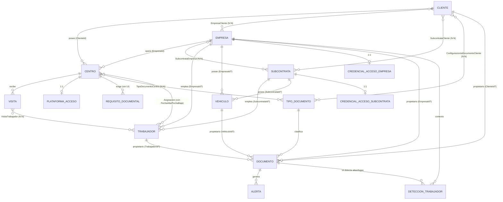

# Plan técnico — Rediseño de navegación contextual: Master-Detail Workspace

> ## ESTADO: HISTÓRICO · NO NORMATIVO
>
> Este documento pertenece al sistema de diseño **anterior** al reset documental de agosto de 2026.
> Puede contener decisiones, propuestas o especificaciones que fueron sustituidas después.
>
> **Este documento NO constituye autoridad sobre el sistema vigente.**
>
> - Decisiones vigentes → `DESIGN_DECISION_LOG.md`
> - Normativa vigente → `01_PRODUCT_EXPERIENCE.md` … `08_COMPONENT_CATALOG.md`
> - Especificación de una superficie → `docs/blueprints/`
>
> **Sustituido por**: `05_WORKSPACE_PATTERNS.md` (ya lo estaba antes por `PLAN-CONTEXT-WORKSPACE.md`)
> **Decisiones relacionadas**: DDL-006, DDL-022
> **Por qué se conserva**: su § 2 contiene el grafo de relaciones verificado contra el dominio, evidencia de por qué la navegación no puede asumir un árbol de un solo padre (`03` § 6).

**Estado**: Propuesta / análisis. No implementado. Este documento es la fase de análisis pedida antes de tocar código — ninguna sección de esto es una decisión tomada, es la base para decidir.

## 0. Resumen del hallazgo principal

Hoy **no existe** ningún patrón master-detail en la aplicación. Las 24 pantallas de negocio siguen todas el mismo patrón: **lista plana (QuickGrid) + Drawer lateral para crear/editar** (ver `UX_PATTERNS.md` § Crear/Editar). La navegación entre entidades relacionadas no existe como tal — se simula con:

- Query strings de filtro (`/centros?q=Bebidas+Norte`, `/empresas?q=...`) que buscan por texto, no navegan a un detalle real.
- Un único caso de "ir al recurso relacionado" (`/documentos?documentoId=X`) usado por Dashboard/Alertas/Calendario, que hoy solo resalta una fila en la lista, no abre un detalle.
- Ningún componente `Tabs`, `Popover` o de "vista de detalle" existe todavía (confirmado en `DESIGN_SYSTEM.md` § Pendientes).

Esto confirma que el pedido no es "mejorar" un master-detail existente — es construirlo desde cero sobre una base de listas planas.

---

## 1. Inventario de pantallas existentes

| Ruta | Página (archivo) | Entidad principal | Patrón actual |
|---|---|---|---|
| `/` | `Dashboard/Pages/Dashboard.razor` | Agregado (KPIs multi-entidad) | Panel de métricas + enlaces de salida (`IrADocumento`, `IrACentro`, `IrAEmpresa`) |
| `/clientes` | `Clientes/Pages/Clientes.razor` | Cliente | Lista + Drawer |
| `/clientes/importar` | `Clientes/Pages/ImportarClientes.razor` | Cliente (bulk) | Página de importación (wizard/progreso) |
| `/clientes/importar-combinado` | `Clientes/Pages/ImportarCombinado.razor` | Cliente+Centro+Empresa (bulk) | Página de importación combinada |
| `/clientes/{ClienteId:guid}/lectura-ia` | `Clientes/Pages/ConfiguracionIaCliente.razor` | Cliente × TipoDocumento (config IA) | Página completa dedicada, con `ClienteId` en la ruta (único caso de ruta paramétrica de "detalle" hoy) |
| `/empresas` | `Empresas/Pages/Empresas.razor` | Empresa | Lista + Drawer |
| `/empresas/{EmpresaId:guid}/deteccion-trabajadores` | `Empresas/Pages/DeteccionTrabajadores.razor` | DeteccionTrabajador (por Empresa) | Página completa dedicada, cola de revisión |
| `/subcontratas` | `Subcontratas/Pages/Subcontratas.razor` | Subcontrata | Lista + Drawer |
| `/centros` | `Centros/Pages/Centros.razor` | Centro | Lista + Drawer |
| `/trabajadores` | `Trabajadores/Pages/Trabajadores.razor` | Trabajador | Lista + Drawer, filtro por Empresa/Subcontrata |
| `/vehiculos` | `Vehiculos/Pages/Vehiculos.razor` | Vehiculo | Lista + Drawer |
| `/asignaciones` | `Asignaciones/Pages/Asignaciones.razor` | Asignacion (Trabajador↔Centro) | Lista + Drawer — entidad de relación tratada como pantalla de primer nivel |
| `/documentos` | `Documentos/Pages/Documentos.razor` | Documento (propietario polimórfico) | Lista + Drawer, filtro por Ámbito/Estado |
| `/documentos/importar` | `Documentos/Pages/ImportarDocumentos.razor` | Documento (bulk) | Página de importación |
| `/documentos/{id}/archivo` | endpoint (no `.razor`) | Documento | Descarga/visor de PDF |
| `/visitas` | `Visitas/Pages/Visitas.razor` | Visita (Centro × Trabajadores) | Lista + Drawer |
| `/alertas` | `Alertas/Pages/Alertas.razor` | Alerta (derivada de Documento) | Lista de solo lectura + enlace de salida a Documentos |
| `/calendario` | `Calendario/Pages/Calendario.razor` | Vista agenda (Documento + Visita) | Vista de calendario, no CRUD |
| `/reportes` | `Reportes/Pages/Reportes.razor` | Cruzada (export Excel/PDF) | Página de exportación, no CRUD |
| `/usuarios` | `Usuarios/Pages/Usuarios.razor` | ApplicationUser (Identity) | Lista + Drawer |
| `/roles` | `GestionRoles/Pages/Roles.razor` | Rol × ApplicationUser | Lista + gestión de pendientes |
| `/tipos-documento` | `TiposDocumento/Pages/TiposDocumento.razor` | TipoDocumento (catálogo) | Lista + Drawer |
| `/configuracion` | `Configuracion/Pages/Configuracion.razor` | ParametroSistema (singleton) | Formulario único, sin lista |
| `/auditoria` | `Auditoria/Pages/Auditoria.razor` | Auditoria (cruzada) | Lista de solo lectura |
| `/importacion` | `Importacion/Pages/Importacion.razor` | — (hub) | Página que solo enlaza a los 3 wizards de importación |

Componentes flotantes (no rutas propias, aparecen sobre cualquier pantalla): `BusquedaGlobal/BuscadorGlobal.razor` (⌘K), `Notificaciones/NotificacionesPopup.razor`, `AsistenteIa/AsistenteIa.razor`.

**No existe UI para `RequisitoDocumental`** — la entidad de dominio existe (`src/CaeManager.Domain/RequisitosDocumentales/RequisitoDocumental.cs`) pero no tiene Command/Query en `Application` ni pantalla en `Web`. Es una funcionalidad de dominio sin construir, no una pantalla que "falta migrar".

---

## 2. Relaciones reales entre entidades (verificado en código, no en `DATABASE.md`)

`DATABASE.md` está desactualizado — no menciona `Subcontrata`, `Vehiculo`, `Visita`, ni las relaciones N:N reales. El grafo verificado hoy en `src/CaeManager.Domain/`:

Puntos que **no** encajan en un árbol estricto de un solo padre (importante para el diseño de navegación):

1. **`Documento` tiene 4 propietarios posibles, mutuamente excluyentes**: `TrabajadorId`, `ClienteId`, `EmpresaId`, `VehiculoId` (todos nullable). No hay "el" padre de Documento — depende de la instancia.
2. **`Centro` cuelga simultáneamente de `Cliente` y de `Empresa`** (ambos FK requeridas) — no es hijo único de uno.
3. **`Trabajador` y `Vehiculo` comparten el mismo patrón**: pertenecen a `Empresa` **o** `Subcontrata` (nunca ambos, nunca ninguno — `EsDeSubcontrata`).
4. Existen **tres implementaciones paralelas y con nombres distintos** del mismo concepto ("credenciales de un portal externo"): `PlataformaAcceso` (Centro), `CredencialAccesoEmpresa`, `CredencialAccesoSubcontrata`. Mismo shape, tres clases — candidato a unificar, pero es un cambio de modelo de datos, no de navegación; **fuera de alcance de este refactor** salvo decisión explícita aparte.

---

## 3. Pantallas que deberían desaparecer (como ruta de primer nivel)

- **`/importacion`** — es un hub que solo enlaza a los 3 wizards de importación (`ver Importacion.razor`). Con acciones contextuales de "Importar" dentro de cada Master Workspace (Clientes, Documentos), este hub pierde su única razón de existir.
- **`/asignaciones`** — hoy es una lista plana de una entidad de relación pura (Trabajador↔Centro). Con Side Workspace, la gestión de asignaciones vive naturalmente en dos sitios: pestaña "Centros asignados" del detalle de Trabajador, y pestaña "Trabajadores asignados" del detalle de Centro. Una lista global de asignaciones sin contexto de Trabajador o Centro tiene poco valor de negocio propio.
- **`/clientes/{id}/lectura-ia`** como página de nivel superior — pasa a ser una pestaña/sección dentro del Side Workspace de Cliente.
- **`/empresas/{id}/deteccion-trabajadores`** como página de nivel superior — pasa a ser una pestaña dentro del Side Workspace de Empresa (o se mantiene como cola de revisión aparte si el volumen de detecciones lo justifica; a decidir con el usuario, no asumir).

No desaparecen (son vistas cruzadas, no CRUD de una entidad, y no encajan en master-detail): `Dashboard`, `Alertas`, `Calendario`, `Reportes`, `Auditoria`, `Configuracion`, `Usuarios`, `Roles`, `Importacion` como wizards individuales (`/clientes/importar`, `/clientes/importar-combinado`, `/documentos/importar` siguen existiendo, solo cambia cómo se llega a ellas).

---

## 4. Pantallas que deberían convertirse en Side Workspace (Master-Detail)

Las 8 pantallas de agregado raíz con relaciones reales y volumen de datos que justifican un detalle:

| Master | Side Workspace muestra (pestañas propuestas) |
|---|---|
| Clientes | Datos, Centros, Empresas relacionadas, Subcontratas relacionadas, Documentos (ámbito Cliente), Config. lectura IA |
| Empresas | Datos, Credencial de acceso, Centros que opera, Trabajadores, Vehículos, Subcontratas relacionadas, Documentos (ámbito Empresa), Detección de trabajadores |
| Subcontratas | Datos, Credencial de acceso, Clientes/Empresas relacionadas, Trabajadores, Vehículos |
| Centros | Datos, Plataforma de acceso, Requisitos documentales (**construir UI por primera vez**), Tipos de documento exigidos, Trabajadores asignados (Asignacion), Visitas |
| Trabajadores | Datos, Documentos, Asignaciones (Centros), Visitas en las que participó |
| Vehículos | Datos, Documentos |
| Documentos | Datos, Propietario (enlace al Cliente/Empresa/Trabajador/Vehículo que corresponda), Alertas generadas, Archivo/PDF |
| Visitas | Datos, Centro, Trabajadores participantes |

No se recomienda Side Workspace para: `TiposDocumento`, `Configuracion`, `Usuarios`, `Roles` — son catálogos/administración de bajo volumen y uso infrecuente; forzar un panel de detalle ahí es complejidad especulativa (YAGNI, `PROJECT.md` § Principios).

---

## 5. Componentes reutilizables sin cambios

- `Drawer.razor`, `Modal.razor`, `DialogoConfirmacion.razor` — siguen siendo el patrón correcto para creación rápida de un agregado simple y confirmaciones destructivas, incluso lanzados *desde* un Side Workspace.
- `SelectorMultiple.razor` — encaja directamente en la gestión de relaciones N:N dentro de un panel de detalle (elegir Centros para un Trabajador, Trabajadores para una Visita).
- `CampoTexto`/`CampoSelect`/`CampoTextarea`, `Boton`, `Badge`, `Icono`, `EstadoVacio`, `EstadoCargando`, `ToastService`/`AnfitrionToasts` — sin cambios.
- `QuickGrid` + tema `tabla-datos` — sigue siendo el motor de la lista maestra **y** de las sub-listas dentro del panel de detalle (p. ej. tabla de Documentos dentro del detalle de Trabajador).
- Lógica de `BuscadorGlobal` (debounce, `BuscarGlobalQuery`) — reutilizable, pero su acción final (`Navigation.NavigateTo(destino)`) debe cambiar de "navegar a lista con filtro de texto" a "abrir Side Workspace del resultado" (ver riesgos, § 6).

## 6. Componentes que deben dividirse

Code-behind actuales que mezclan lista + formulario + lógica específica y no sobrevivirán intactos al nuevo patrón:

| Archivo | Líneas | Por qué se divide |
|---|---|---|
| `Documentos/Pages/Documentos.razor.cs` | 502 | Mezcla: filtro/paginación de lista, formulario polimórfico (selector Trabajador/Cliente/Empresa/Vehículo), subida/conversión de archivo. Dividir en: lista maestra, `SelectorPropietarioDocumento` (nuevo componente aislado), formulario de creación/edición, y el nuevo `DocumentoDetallePanel`. |
| `Trabajadores/Pages/Trabajadores.razor.cs` | 347 | Dividir en lista maestra + nuevo `TrabajadorDetallePanel` (pestañas Documentos/Asignaciones/Visitas) — hoy toda esa información no existe en la página, se añade de cero. |
| `Subcontratas/Pages/Subcontratas.razor.cs` | 318 | Igual patrón: lista + nuevo panel con Credencial/Clientes/Trabajadores/Vehículos. |
| `Vehiculos/Pages/Vehiculos.razor.cs` | 303 | Lista + panel con Documentos del vehículo. |
| `Usuarios/Pages/Usuarios.razor.cs` | 303 | **No requiere panel de detalle** (ver § 4) — se deja como está; se menciona aquí solo para descartarlo explícitamente. |
| `Empresas/Pages/Empresas.razor.cs` | 303 | Lista + panel con Credencial/Centros/Trabajadores/Vehículos/Subcontratas/Detección. |
| `Centros/Pages/Centros.razor.cs` | 261 | El más cargado de pestañas nuevas (Plataforma, Requisitos —a construir—, Tipos exigidos, Asignaciones, Visitas). Candidato a dividir primero el layout de pestañas como componente propio reutilizable. |

Además, a nivel de shell: `Components/Layout/MainLayout.razor` hoy es nav + barra superior + un único `@Body`. Necesita un nuevo componente contenedor (`WorkspaceLayout` o similar) que sostenga el layout de dos/tres columnas (nav + lista maestra + panel lateral) sin que cada página lo reimplemente — de lo contrario se repetirá el layout 8 veces (violaría "Consistencia de patrones" de `PROJECT.md`).

No existe hoy ningún componente `Tabs` (confirmado pendiente en `DESIGN_SYSTEM.md`) — es un componente nuevo a construir antes de la primera pantalla migrada, no una división de uno existente.

---

## 7. Riesgos del refactor

1. **Seguridad por cartera (`IAlcanceDatosService`)**: cada nueva sub-lista dentro de un panel (Documentos de un Trabajador, Trabajadores de un Centro, etc.) es una Query nueva. `CLAUDE.md` ya prohíbe SQL crudo/`IgnoreQueryFilters()` sin revisión — el mismo rigor aplica aquí: cada Query nueva de "relacionados" debe pasar por `IAlcanceDatosService`, igual que las `*PorId*` corregidas en el Issue #18. Es el riesgo más alto porque son N queries nuevas, no una.
2. **Compatibilidad de URLs persistidas**: `NotificacionUsuario.UrlAccion` se guarda en base de datos con rutas como `/documentos?documentoId=X`; los correos enviados vía `GraphEmailService` pueden contener enlaces ya entregados a usuarios. Cambiar el *significado* de esas rutas es seguro (que abran el panel en vez de resaltar una fila); **cambiar la URL en sí** rompe notificaciones ya enviadas y no editables.
3. **Gestión de estado en Blazor Server**: lista maestra + panel de detalle interactivos simultáneamente en el mismo circuito SignalR — riesgo de renders innecesarios o de estado cruzado si no se diseña con cuidado el flujo de parámetros/eventos entre ambos paneles.
4. **Deep-linking y regla de "≤3 clics" (`UX_PATTERNS.md`)**: hoy los filtros persisten en la URL. El detalle seleccionado también debe persistir en la URL (`/trabajadores/{id}` o `?id=`) para no perder "compartir/recargar sin perder contexto" — si no se diseña desde el inicio, se pierde una garantía de UX ya establecida.
5. **Accesibilidad (WCAG AA, no negociable)**: un layout de dos/tres columnas exige gestión de foco al abrir/cerrar el panel, landmarks ARIA nuevos, y comportamiento de teclado (Escape, Tab) coherente con lo que ya exige `Drawer`/`Modal`. El `Tabs` nuevo debe nacer accesible, no parchearse después.
6. **Responsive**: el sistema hoy solo define comportamiento de 2 columnas (sidebar + contenido). Un master-detail de 3 columnas no tiene estrategia definida para tablet/mobile (`UX_PATTERNS.md`/`DESIGN_SYSTEM.md` no lo cubren) — hay que decidirlo (¿panel se vuelve overlay a pantalla completa en mobile?) antes de construir, o habrá regresión real en esos breakpoints.
7. **Grafo sin jerarquía única**: `Documento` (4 propietarios posibles) y `Centro` (Cliente + Empresa simultáneos) no encajan en "un padre por entidad". El diseño debe tratar la relación secundaria como enlace cruzado (chip/breadcrumb) dentro del panel, nunca forzar un árbol estricto, o la navegación será inconsistente entre entidades.
8. **Alcance/scope creep con `PlataformaAcceso`/`CredencialAccesoEmpresa`/`CredencialAccesoSubcontrata`**: son 3 clases duplicadas para el mismo concepto. Es tentador "arreglarlo de paso" durante este refactor — se recomienda **no hacerlo**: es un cambio de modelo de datos independiente, mezclarlo con el refactor de navegación duplica el riesgo de una sola migración.
9. **Migración incremental con dos paradigmas conviviendo**: mientras se migra entidad por entidad, la app tendrá temporalmente unas pantallas en el patrón viejo (lista+Drawer) y otras en el nuevo (Master-Detail). Debe comunicarse/secuenciarse por fases claras (como ya hace `ROADMAP.md` con el resto del producto), nunca como "big bang".
10. **Verificación end-to-end obligatoria** (`CLAUDE.md`): cada fase de este plan cierra con navegador real, no solo tests — con 8 entidades a migrar, esto es 8 rondas de verificación manual, a presupuestar en tiempo.

---

## 8. Rutas que deberían mantenerse por compatibilidad

Mantener el **string de ruta** para todo lo que ya está enlazado desde fuera de la navegación normal (notificaciones persistidas, correos, buscador global), cambiando solo qué renderizan:

- `/documentos?documentoId={id}` (usado por `Dashboard`, `Alertas`, `Calendario`) → debe seguir abriendo algo válido; pasa a abrir el Side Workspace del Documento en vez de solo resaltar la fila.
- `/centros?q={texto}`, `/empresas?q={texto}` (usado por `Dashboard.IrACentro`/`IrAEmpresa`) → el parámetro de texto se mantiene como filtro de la lista maestra.
- `/documentos/{id}/archivo` — endpoint de descarga, no cambia.
- `/clientes/{ClienteId:guid}/lectura-ia` — si se pliega dentro del Side Workspace de Cliente, mantener la ruta como redirect a `/clientes/{id}?panel=lectura-ia` en vez de eliminarla (por si hay enlaces guardados/documentación interna que la referencian).
- `/empresas/{EmpresaId:guid}/deteccion-trabajadores` — mismo criterio: redirect si se pliega a pestaña.
- Todas las rutas de importación (`/clientes/importar`, `/clientes/importar-combinado`, `/documentos/importar`) — no cambian, solo cambia desde dónde se enlazan.
- `/asignaciones` — aunque desaparezca como entrada de navegación (§ 3), mantener la ruta funcionando (redirige a `/trabajadores` o queda como vista de solo lectura) por si hay reportes/favoritos guardados apuntando ahí.

Regla general: **nunca renombrar una ruta existente** en este refactor; solo añadir segmentos/parámetros opcionales nuevos (`{id}`, `?panel=`) a lo que ya existe. Renombrar es un cambio de mayor riesgo que no aporta valor de UX y rompe lo mencionado arriba.

---

## 9. Plan de migración paso a paso

Cada fase termina, sin excepción, con verificación end-to-end en navegador (regla ya establecida en `CLAUDE.md`/`ROADMAP.md`) antes de pasar a la siguiente.

**Fase 0 — Cimientos (sin cambio visible para el usuario)**
- Construir el componente `Tabs` (accesible: teclado, ARIA) — no existe hoy.
- Construir el layout de Workspace (nav + lista maestra + panel lateral) como componente de layout reutilizable, no copiado por pantalla.
- Definir y documentar el patrón de URL para "detalle seleccionado" (`{id}` vs `?panel=`) en `UX_PATTERNS.md`/`ARCHITECTURE.md` antes de aplicarlo, para que las 8 migraciones siguientes sean consistentes entre sí.
- Auditar y blindar el patrón de Query para "relacionados" (aplicar `IAlcanceDatosService` desde la primera, no al final como pasó con el Issue #18).

**Fase 1 — Piloto en una sola entidad: Trabajador**
- Se elige Trabajador por ser la entidad con relaciones más ricas y ya bien entendidas (Documentos, Asignaciones, Visitas) pero acotada. Sirve para validar el patrón completo antes de replicarlo.
- Verificación end-to-end + aprobación explícita del usuario del patrón antes de continuar (es un cambio de UX de fondo, no solo técnico).

**Fase 2 — Grupo "Negocio": Cliente, Empresa, Subcontrata**
- Migran juntas por compartir las relaciones N:N entre sí (`EmpresaCliente`, `SubcontrataCliente`, `SubcontrataEmpresa`) — migrar una sin las otras dejaría enlaces cruzados rotos a mitad de camino.

**Fase 3 — Centro**
- La pantalla con más pestañas nuevas, incluida la primera UI de `RequisitoDocumental` (no existe hoy — es funcionalidad nueva, no migración). Se hace sola porque es la de mayor riesgo/superficie.

**Fase 4 — Documento y Vehículo**
- Documento al final porque su propietario polimórfico depende de que Cliente/Empresa/Trabajador/Vehículo ya tengan su Side Workspace listo para enlazar "volver al propietario".
- En esta fase se actualizan `Dashboard`, `Alertas`, `Calendario` y `BuscadorGlobal` para abrir el panel de Documento en vez de navegar a la lista con query string (manteniendo las URLs viejas funcionando, § 8).

**Fase 5 — Retirar pantallas de primer nivel obsoletas**
- Plegar `/asignaciones` y `/importacion` (hub) según § 3, dejando redirects donde aplique.
- Plegar `/clientes/{id}/lectura-ia` y `/empresas/{id}/deteccion-trabajadores` a pestañas dentro de sus Side Workspaces respectivos.

**Fase 6 — Cierre y documentación**
- Auditoría de accesibilidad y de comportamiento responsive/mobile en las 8 pantallas migradas.
- Actualizar `DESIGN_SYSTEM.md` (nuevo componente `Tabs`, patrón "Side Workspace" documentado como estándar), `UX_PATTERNS.md` (nuevo patrón de navegación contextual) y `ARCHITECTURE.md` (nuevo layout de Presentation) — mismo criterio que el proyecto ya aplica de documentar cada fase en `ROADMAP.md`.
- Limpieza de código muerto (formularios/páginas viejas ya reemplazadas).

No se recomienda ninguna fase que toque `TiposDocumento`, `Configuracion`, `Usuarios`, `Roles`, `Auditoria`, `Reportes` — quedan fuera de alcance de este refactor por diseño (§ 4).
